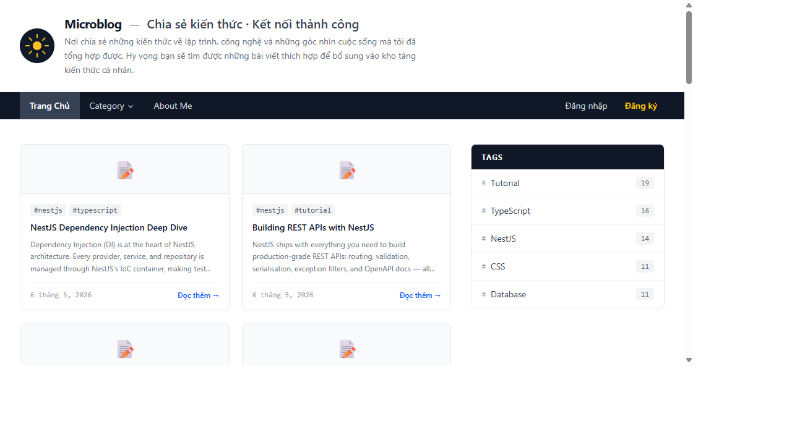
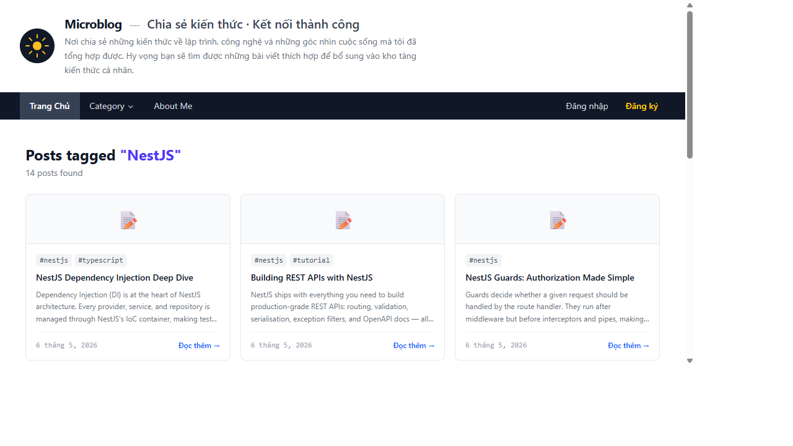
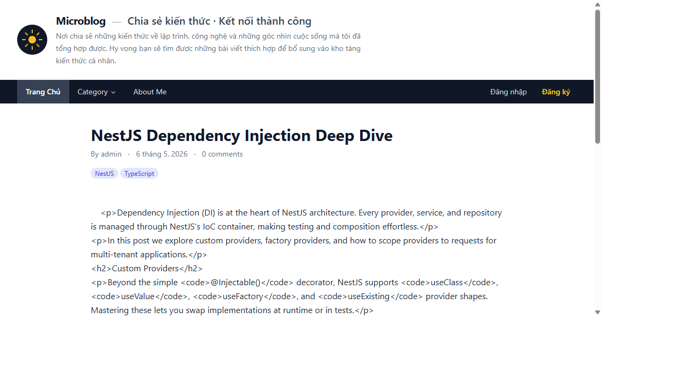
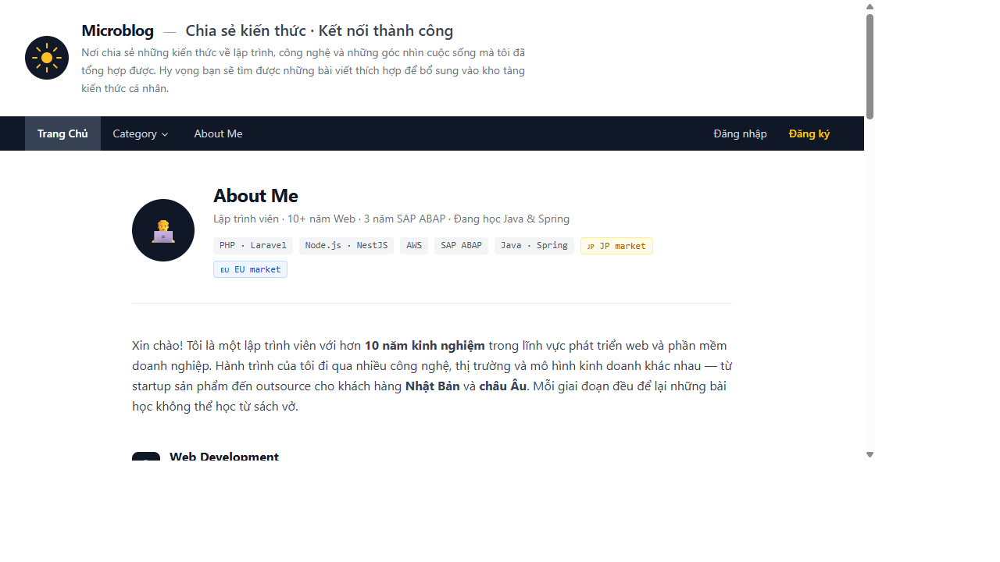
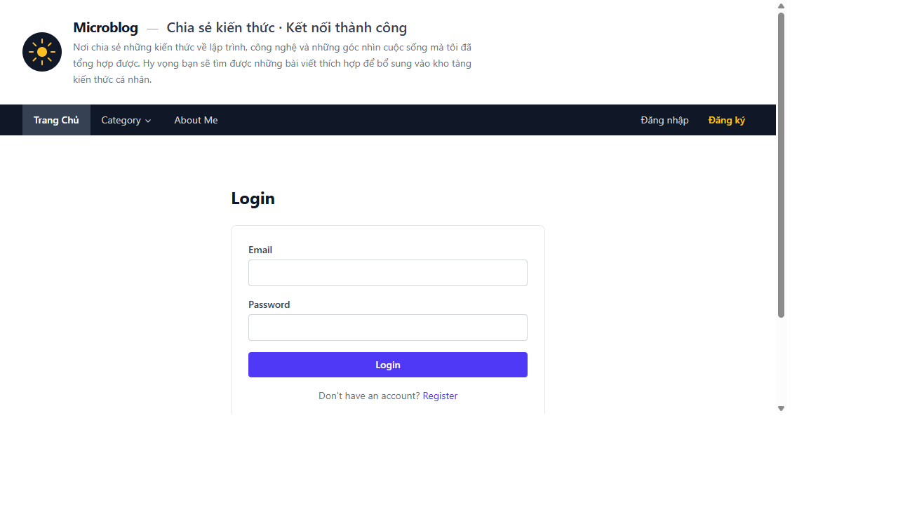
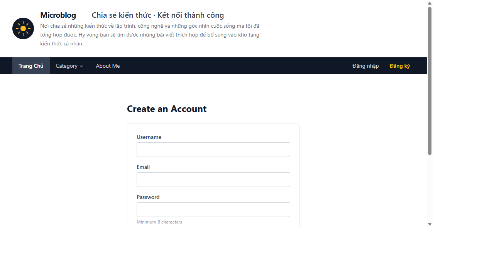

<p align="center">
  
</p>

<h1 align="center">Microblog CMS</h1>

<p align="center">
  A personal blogging platform built with <strong>NestJS 11</strong> · <strong>Handlebars SSR</strong> · <strong>Tailwind CSS v4</strong> · <strong>MySQL 8</strong>
</p>

<p align="center">
  
  
  
  
</p>

---

## Table of Contents

1. [Overview](#overview)
2. [Screenshots](#screenshots)
3. [Features](#features)
4. [Tech Stack](#tech-stack)
5. [Getting Started](#getting-started)
6. [Environment Variables](#environment-variables)
7. [Database & Migrations](#database--migrations)
8. [Project Structure](#project-structure)
9. [URL Routes](#url-routes)
10. [Authentication](#authentication)
11. [Roles & Permissions](#roles--permissions)
12. [npm Scripts](#npm-scripts)

---

## Overview

Microblog CMS is a server-side-rendered personal blog platform. Authors write posts, tag them, and submit them for admin approval before they go live. Visitors browse posts by tag, leave comments (moderated), and read a rich About Me page.

---

## Screenshots

### Homepage

Post grid (3 columns, max 15 posts) with tag sidebar and pagination.



### Tag Page

Posts filtered by tag, paginated 9 per page with active-page highlight.



### Post Detail

Full article with author, date, tag chips, body, and comment form.



### About Me

Detailed bio page with tech timeline (Web / SAP / Java), project experience, and contact links.



### Login

JWT-based login with HTTP-only cookie auth.



### Register

New account registration with validation.



---

## Features

| Area | Detail |
|---|---|
| **Public** | Homepage (15 posts/page), tag pages (9/page), post detail, About Me |
| **Auth** | Register, login, logout, JWT access + refresh token rotation |
| **Comments** | Guests/users can submit comments; held for admin approval |
| **Dashboard** | Authenticated users: write posts, view status (draft / pending / published) |
| **Admin** | Admin role: approve/reject posts and comments |
| **Security** | Helmet, CSRF (`csurf`), rate limiting (`@nestjs/throttler`), bcrypt |
| **CSS** | Tailwind CSS v4 CLI build, minified output |

---

## Tech Stack

| Layer | Technology |
|---|---|
| Runtime | Node.js v22 |
| Framework | NestJS v11 (`@nestjs/platform-express`) |
| Language | TypeScript 5.x — `strict: true` |
| View Engine | Handlebars (express-handlebars), SSR |
| CSS | Tailwind CSS v4 (`@tailwindcss/cli`) |
| ORM | TypeORM v0.3 — `synchronize: false`, explicit migrations |
| Database | MySQL 8.0 (via Docker Compose) |
| Auth | JWT (access + refresh), `passport-jwt`, HTTP-only cookies |
| Session | `express-session` + `connect-flash` |
| Security | `helmet`, `csurf`, `@nestjs/throttler` |

---

## Getting Started

### Prerequisites

- **Node.js** v20+
- **Docker Desktop** (for MySQL)

### Installation

```bash
# 1. Clone and install
git clone <repo-url>
cd microblog_nestjs
npm install

# 2. Copy env file and fill in secrets
cp .env.example .env

# 3. Start MySQL via Docker
docker-compose up -d

# 4. Run database migrations (creates tables + seeds data)
npm run migration:run

# 5. Build Tailwind CSS
npm run build:css

# 6. Start the dev server
npm run start:dev
```

Open **http://localhost:3000** in your browser.

**Default admin account** (created by seed migration):
- Email: `admin@example.com`
- Password: `Admin1234!`

---

## Environment Variables

Copy `.env.example` to `.env` and set the following:

| Variable | Description | Example |
|---|---|---|
| `PORT` | HTTP port | `3000` |
| `NODE_ENV` | Environment | `development` |
| `DB_HOST` | MySQL host | `localhost` |
| `DB_PORT` | MySQL port | `3306` |
| `DB_USERNAME` | DB user | `root` |
| `DB_PASSWORD` | DB password | `yourpassword` |
| `DB_NAME` | Database name | `microblog` |
| `JWT_ACCESS_SECRET` | Secret for access tokens (min 32 chars) | `change-me-32chars-minimum` |
| `JWT_REFRESH_SECRET` | Secret for refresh tokens (min 32 chars) | `change-me-32chars-minimum` |
| `SESSION_SECRET` | express-session secret | `session-secret` |
| `COOKIE_SECRET` | cookie-parser signing secret | `cookie-secret` |

> **Security note**: Never commit `.env` to version control. It is in `.gitignore`.

---

## Database & Migrations

TypeORM is configured with `synchronize: false`. All schema changes must go through migrations.

```bash
# Run all pending migrations
npm run migration:run

# Generate a new migration (after editing entities)
npm run migration:generate -- src/migrations/MyMigrationName

# Revert the last migration
npm run migration:revert
```

### Migration history

| # | File | Description |
|---|---|---|
| 001 | `CreateUsers` | Users table |
| 002 | `CreatePosts` | Posts table |
| 003 | `CreateTags` | Tags table |
| 004 | `CreatePostTags` | Post ↔ tag pivot |
| 005 | `CreateComments` | Comments table |
| 006 | `CreatePages` | Static pages table |
| 007 | `CreateRefreshTokens` | Refresh token table |
| 008 | `SeedAdmin` | Admin user + initial tags |
| 009 | `SeedPosts` | Initial 5 sample posts |
| 010 | `SeedMorePosts` | 48 additional posts (10+ per tag) |
| 011 | `UpdateAboutPage` | Detailed About Me content |

---

## Project Structure

```
microblog_nestjs/
├── src/
│   ├── config/              # TypeORM DataSource, DB config
│   ├── entities/            # TypeORM entity classes
│   │   ├── user.entity.ts
│   │   ├── post.entity.ts
│   │   ├── tag.entity.ts
│   │   ├── comment.entity.ts
│   │   ├── page.entity.ts
│   │   └── refresh-token.entity.ts
│   ├── migrations/          # Migration files (run in order)
│   ├── modules/
│   │   ├── auth/            # JWT auth, guards, strategies, CSRF
│   │   ├── admin/           # Post & comment moderation
│   │   ├── comments/        # Public comment submission
│   │   ├── pages/           # Static pages (About Me)
│   │   ├── posts/           # Post browsing + authoring
│   │   ├── tags/            # Tag browsing with pagination
│   │   └── users/           # User accounts + dashboard
│   ├── common/
│   │   ├── filters/         # HttpExceptionFilter (404, CSRF, 500)
│   │   ├── guards/          # JwtAuthGuard, RolesGuard
│   │   ├── helpers/         # Handlebars helpers (formatDate, tagIcon)
│   │   └── middleware/      # UserLocalsMiddleware (injects user into templates)
│   ├── styles/
│   │   └── input.css        # Tailwind CSS entry point
│   ├── app.module.ts        # Root module, middleware config
│   └── main.ts              # Bootstrap, Express middleware stack
│
├── views/
│   ├── layouts/
│   │   └── main.hbs         # Global layout (header, nav, footer)
│   ├── partials/
│   │   ├── nav.hbs          # Navigation bar
│   │   ├── post-card.hbs    # Post preview card
│   │   ├── pagination.hbs   # Page navigation
│   │   └── sidebar-right.hbs # Tags widget
│   ├── pages/
│   │   ├── home.hbs         # Homepage
│   │   ├── post.hbs         # Post detail
│   │   └── about.hbs        # About Me
│   ├── auth/
│   │   ├── login.hbs
│   │   └── register.hbs
│   ├── dashboard/           # Authenticated user dashboard
│   ├── admin/               # Admin moderation views
│   └── errors/              # 404, 500 error pages
│
├── public/
│   └── css/
│       └── tailwind.css     # Built CSS (do not edit manually)
│
├── docker-compose.yml       # MySQL 8 container
├── .env.example             # Environment variable template
└── nest-cli.json
```

---

## URL Routes

### Public

| Method | Path | Description |
|---|---|---|
| `GET` | `/` | Homepage — latest 15 posts, paginated |
| `GET` | `/?page=N` | Homepage page N |
| `GET` | `/posts/:slug` | Post detail page |
| `GET` | `/tags/:slug` | Posts filtered by tag (9/page) |
| `GET` | `/tags/:slug?page=N` | Tag page N |
| `GET` | `/about` | About Me page |

### Auth

| Method | Path | Description |
|---|---|---|
| `GET` | `/login` | Login form |
| `POST` | `/login` | Submit login credentials |
| `GET` | `/register` | Register form |
| `POST` | `/register` | Submit registration |
| `POST` | `/logout` | Clear auth cookies |
| `POST` | `/auth/refresh` | Rotate access token using refresh token |

### Authenticated Users

| Method | Path | Description |
|---|---|---|
| `GET` | `/dashboard` | User's own posts + status |
| `GET` | `/posts/new` | New post form |
| `POST` | `/posts` | Create post (saved as `draft`) |
| `GET` | `/posts/:id/edit` | Edit post form |
| `POST` | `/posts/:id` | Update post |
| `POST` | `/posts/:id/submit` | Submit post for review |
| `POST` | `/comments` | Submit a comment |

### Admin Only

| Method | Path | Description |
|---|---|---|
| `GET` | `/admin` | Admin dashboard |
| `GET` | `/admin/posts` | All pending posts |
| `POST` | `/admin/posts/:id/publish` | Approve post |
| `POST` | `/admin/posts/:id/reject` | Reject post |
| `GET` | `/admin/comments` | Pending comments |
| `POST` | `/admin/comments/:id/approve` | Approve comment |
| `POST` | `/admin/comments/:id/reject` | Reject comment |

---

## Authentication

The app uses **JWT with HTTP-only cookies** — no localStorage tokens.

### Flow

1. User `POST /login` with email + password
2. Server validates credentials, issues:
   - `access_token` cookie (short-lived, 15 min)
   - `refresh_token` cookie (long-lived, 7 days, hashed in DB)
3. Every request: `UserLocalsMiddleware` reads `access_token`, verifies it, and injects `user` into `res.locals` for all Handlebars templates
4. Protected routes use `JwtAuthGuard` (reads from cookie via `passport-jwt`)
5. On expiry: client calls `POST /auth/refresh` — old refresh token is revoked and a new pair is issued (rotation)

### CSRF Protection

All `POST` forms include a hidden `_csrf` field. The token is generated server-side by `csurf` and injected into `res.locals.csrfToken` on every request.

---

## Roles & Permissions

| Role | Capabilities |
|---|---|
| **Guest** | Browse posts, view tags, read About Me |
| **User** (registered) | All guest + write posts (draft), submit for review, comment |
| **Admin** | All user + approve/reject posts, approve/reject comments |

---

## npm Scripts

| Script | Description |
|---|---|
| `npm run start:dev` | Start NestJS in watch mode (ts-node) |
| `npm run build` | Compile TypeScript to `dist/` |
| `npm run start:prod` | Run compiled `dist/main.js` |
| `npm run build:css` | Build Tailwind CSS once (minified) |
| `npm run watch:css` | Watch and rebuild CSS on changes |
| `npm run migration:run` | Run all pending migrations |
| `npm run migration:revert` | Revert the last migration |
| `npm run migration:generate -- src/migrations/NAME` | Generate migration from entity diff |
| `npm run lint` | Run ESLint |
| `npm test` | Run Jest unit tests |

---

*Built with NestJS & Tailwind CSS — © 2026*

